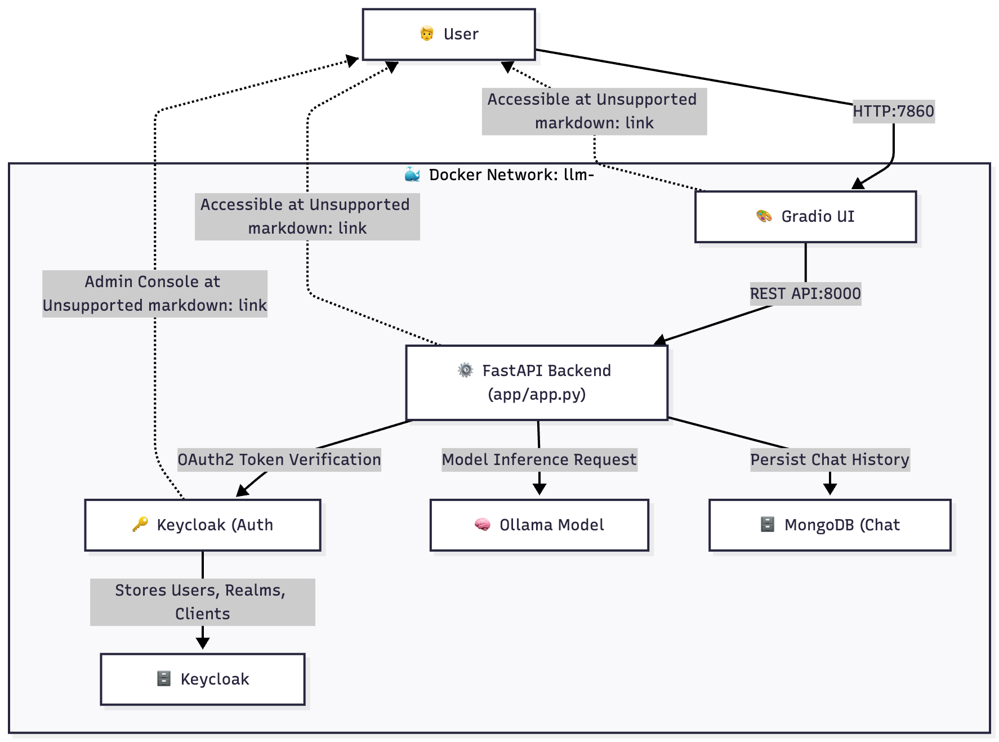

## 🚀 Deployment with Docker Compose (Non-Production Environment)
### Project Overview
This is an LLM-based chat application powered by Ollama for local large language model inference. It features a Gradio Web UI for user interaction and a FastAPI backend that handles chat requests, model responses, and system orchestration. The backend is secured with Keycloak OAuth2, ensuring authenticated access and role-based authorization for users.
You can run your favorite Ollama model with a friendly chat interface or deploy it for team or organizational use, enabling a private, secure, and customizable AI assistant environment within your infrastructure.

### Diagram of Architecture


---

### Tool Versions Used in This Project's Development  
*(Updated: November 2025 — verified latest stable releases)*  

| Tool | Version |
|------|----------|
| **Python** | 3.12.6 |
| **pip** | 25.3 |
| **pytest** | 8.4.2 |
| **Dependencies** | requirements.txt |
| **Ollama CLI** | 0.3.14 |
| **Docker** | 27.3.1 |
| **Docker Compose** | 2.29.2 |
| **Keycloak (Docker image)** | `quay.io/keycloak/keycloak:26.4` |
| **PostgreSQL (Docker image)** | `postgres:18.0` |
| **MongoDB (Docker image)** | `mongo:8.2.1-noble` |

---

✅ *All tools and images above reflect stable or long-term supported (LTS) versions as of November 2025.*

### 🧩 Step 1 — Build 
Download and install Ollama from its webpage https://ollama.com/download


Pull the model (e.g., llama3.2)
```
ollama pull llama3.2
```

Run the model with your prompt
```
ollama run llama3.2 "Hello!"
```

Check available models
```
ollama list
NAME               ID              SIZE      MODIFIED   
llama3.2:latest    a80c4f17acd5    2.0 GB    7 days ago    
```

### 🧩 Step 2— Create a Docker Network (from root folder)
```bash
docker network create llm-net
```
### 🔑 Step 3 — Bring Keycloak Up (in keycloak folder)
Check keycloak/README.md

### ⚙️ Step 4 — Bring the FastAPI + Gradio App Up (from root folder)

Create a .env file to store sensitive parameters.
### Email Configuration

| Variable             | Description                                                                  |
|----------------------|------------------------------------------------------------------------------|
| EMAIL_HOST_USER       | Gmail address used to send verification emails.                             |
| EMAIL_HOST_PASSWORD   | Gmail App Password (not your main password!). Generate it from Google Account → Security → App Passwords. |

---

### Keycloak Admin Configuration

| Variable                | Description                                    |
|-------------------------|------------------------------------------------|
| KEYCLOAK_ADMIN_USERNAME | Keycloak admin account username used by the app. |
| KEYCLOAK_ADMIN_PASSWORD | Password for the Keycloak admin account.      |
| KEYCLOAK_REALM          | The Keycloak realm name.                        |

---

### Client App Configuration

| Variable      | Description                                 |
|---------------|---------------------------------------------|
| CLIENT_ID     | Keycloak client ID for user login (ROPG grant). |
| CLIENT_SECRET | Secret for the client ID.                    |

.env 
```
EMAIL_HOST_USER=<your Google mail>
EMAIL_HOST_PASSWORD=<secret>
KEYCLOAK_ADMIN_USERNAME=llm_admin
KEYCLOAK_ADMIN_PASSWORD=<secret>
KEYCLOAK_REALM=llm
CLIENT_ID=chat-app
CLIENT_SECRET=<secret>
```

Run Docker commands
```
docker compose up -d
```
Or, if you want to rebuild with environment variables:
```
docker-compose --env-file .env up --build
```


To stop
```
docker down -v
```

To restart
```
docker down -v
docker compose up -d
```

⸻

### 🌐 Access the Services
```
Service	URL
FastAPI API	http://localhost:8000
API	Docs	http://localhost:8000/docs	
(or check app/postman.json file)
Gradio UI	http://localhost:7860
Keycloak	http://localhost:8080
```
